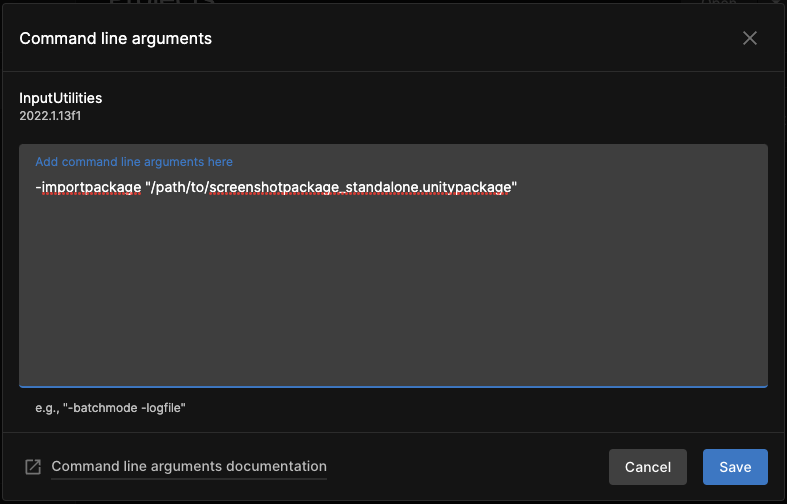

# UnityScreenShot
A little tool to automate making screenshots for your Unity projects 

Takes screenshots at three moments: 
- when the Unity project is loaded
- when you enter Play mode
- whenever you press the Space key in play mode

## Usage (method 1, project folder screenshots):
This method is used when you want the screenshots to be saved in the same folder as your project. The second method is for when you want to save and collect your screenshots in a separate, custom folder.

### Download the .unitypackage file
Save the [screenshotpackage_standalone.unitypackage](https://github.com/jackhoefnagel/UnityScreenShot/blob/main/screenshotpackage_standalone.unitypackage) file to your computer, and copy the path to the file.

### Unity Hub  Command Line Arguments 
In Unity Hub, select options for each of your projects and select "Add command line arguments"

 

---

### Enter Command Line Arguments 
In the input box, enter:

```-importpackage "path/to/screenshotpackage_standalone.unitypackage"```

 

---

### Open the project 
When you open the project, the ScreenShot.cs file is imported into your project, and takes a screenshot when the project is finished loading.
Enter Playmode, and press Spacebar to make additional screenshots while the project is running.

 

---
---

## Usage (method 2, custom external folder screenshots):
### Set path for screenshots
Open ScreenShot.cs and set the customFilePath string to the path where you want to save your screenshots

 

---

### Export script as UnityPackage
Drop ScreenShot.cs in any open Unity project, right click the file and export it as a package file. 
Save the path to your newly exported .unitypackage file.


---

### Unity Hub  Command Line Arguments 
In Unity Hub, select options for each of your projects and select "Add command line arguments"

 

---

### Enter Command Line Arguments 
In the input box, enter:

```-importpackage "path/to/screenshotpackage.unitypackage"```

 

---

### Open the project 
When you open the project, the ScreenShot.cs file is imported into your project, and takes a screenshot when the project is finished loading.
Enter Playmode, and press Spacebar to make additional screenshots while the project is running.

 
